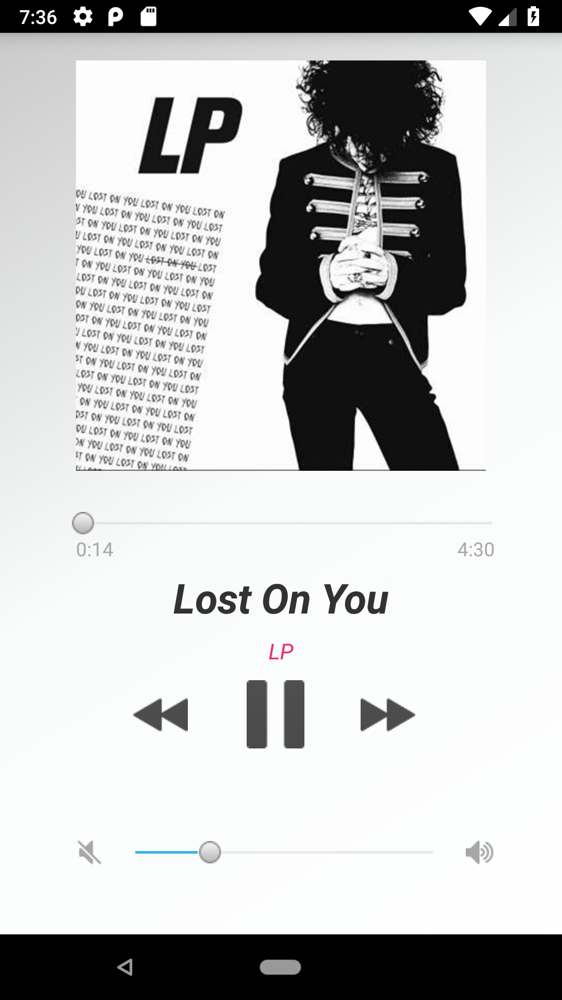
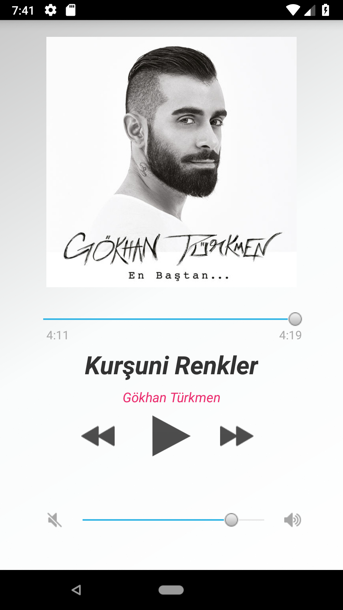

#Audiod - Clone of Apple Music Application

Uygulama tamamen programlama yeteneğimi test etmek amacıyla yaratılmıştır. Herhangi bir ticari kazanç güdülmemiştir. Kendime tasarım olarak beğendiğim Apple Music uygulamasını hedef olarak belirledim ve ilk önce tasarımını daha sonra çalışma mantığını uyguladım.

- **Anasayfada önceden kaydedilmiş müziklerin listesi bulunmaktadır.**
> Bu aşamada uygulamaya müzikler ve albüm fotoğrafları bir API üzerinden eklenebilir.

- **Listeden kullanıcı dinlemek istediği müziği seçer ve müzik oynamaya başlar.**

- **Ana ekrana yeni müzik seçmek için geri dönebilir. Fakat müzik duraklamaz arkaplanda devam eder ve ekranın alt kısmında barda ilerleme gözlemlenir.**

- **Her müzik sonunda sıradaki şarkıya geçiş yapılmaktadır.**

